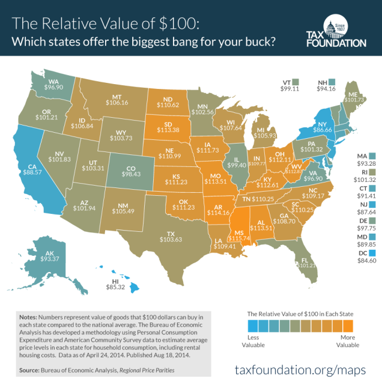

Greener Pastures
========================================================
author: Robert A Lupo
date: 2/28/16
transition: rotate

Finding a new Hometown
========================================================

- Where should you move to?
- Where will you feel at home?
- How affordable will it be?
- What are the social and cultural aspects?

These are complicated questions with many variables to consider.  
Today we're taking on the task of compiling tips on finding the right neighborhood (or city or state) for you, and maps and statistics.  


Topics to think about
========================================================

- Is the weather predictable?
- Can I afford to buy a home?
- Transportation. Is there mass transit?
- Recreation. Indoor or outdoor venues. 

The decisions are many and complex.

Economic opportunities?
========================================================

***


Rural: 
====================================
A pastoral and relaxing community.
______________________

***


Metropolis:
====================================
The dynamic hustle and bustle of the big city.
______________________

***


We can guide you to a better decision 
========================================================

***


So get started:
=======================================================
Go to our free intro app: [Green Pastures](https://boblupo.shinyapps.io/Shiny/)

A beautiful Hometown awaits in the good ole USA!  
USA map created by R *maps* package
```{r, echo=FALSE}
library(maps)
map('usa')
map('state', add=TRUE, fill=TRUE, col='green', boundary='black')
map('county',add=TRUE, fill=TRUE, col='green', boundary='black')
map('lakes', add=TRUE, fill=TRUE, col='blue', boundary='black')
```

